# Cache

## 一般设计

L1 cache : 目标是快，分为data/ inst cache, 单核所有
  I cache : 考虑延迟和分支预测
  D cache : 考虑多端口设计                             
L2 cache ：目标是全，支持多核共享，考虑命中率

cache实现方式：
1.   直接映射：cache中只有一个地方可以容纳
2.   组相联：有多个地方有容纳该数据
3.   全相联:  任意地方都可以容纳

cache miss缺失情况：3C定理
1. compulsory : 第一次访问必定Miss，需要prefetch
2. capacity : 容量限制
3. conflict : 多个数据映射至cache同一位置，victim cache

## cache组成方式
### 直接映射

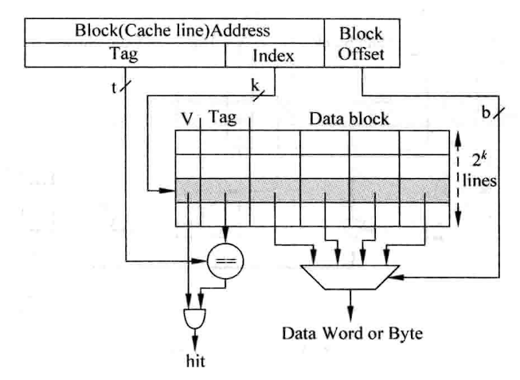

存在问题：index相同会寻址到同一cache line，conflict

cache所占用的空间：data + tag + valid bits

### 组相联

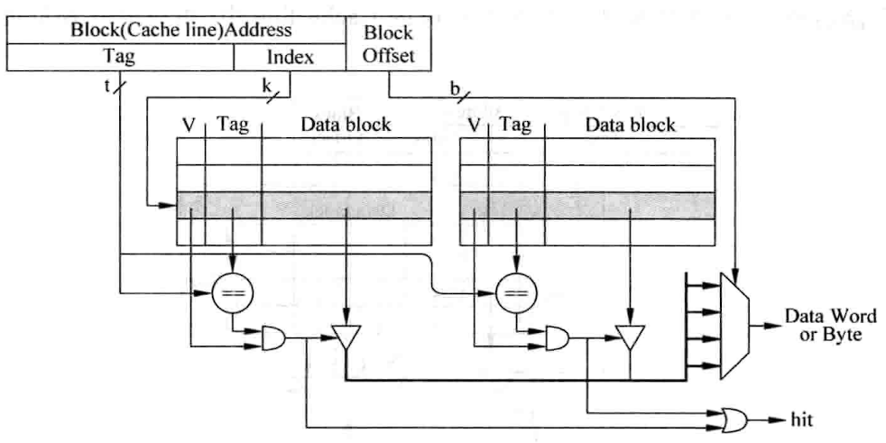

延迟大，但conflict降低

==cache的不同实现方式==

1. 一周期访问完，并行访问data tag SRAM，

     

2. 并行访问的流水线，其中disambiguation是ld/st指令间的相关性检查

     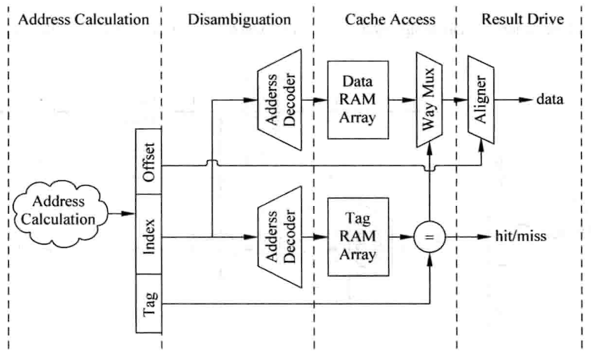

3. 一周期串行访问 tag data SRAM，相比并行减少了way mux使用，且节约功耗（不相干的way不使能)

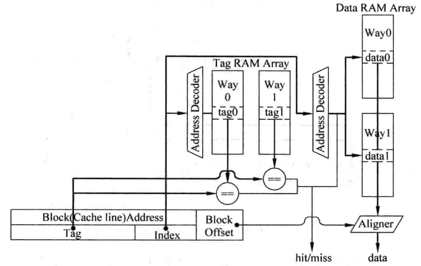

4. 串行访问的流水线， 增加了一个周期，频率高，功耗低，适合超标量

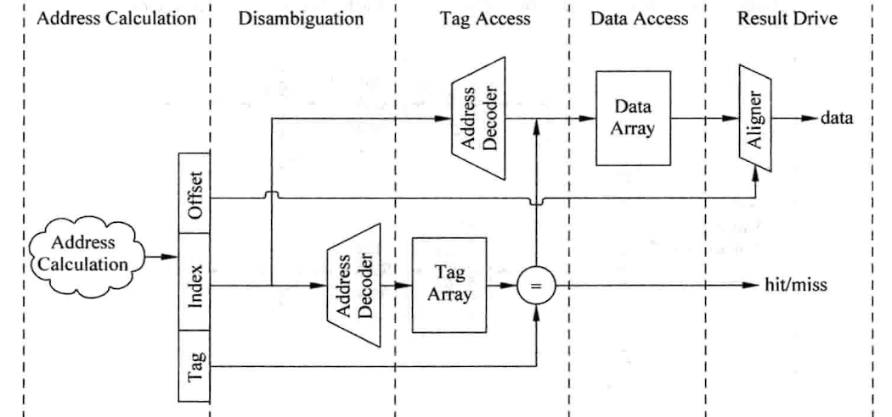, 

### 全相连

没有index，内容寻址，CAM TLB

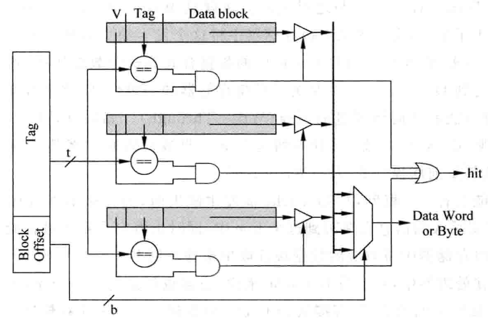

## cache写入

==写入地址存在==
write through : 同时写dcache 和 下级存储器
write back : 写入dcache后做标记，但不写入下级存储器，当该标记的cache line替换时更新到下级存储器，为dirty状态

==写入地址不存在==
non-write allocate : 数据直接写到下级存储器
write allocate : 数据和下级存储器的data block合并，再重写入dcache
	如果该data block也写入下级存储器，即为write through
	如果该data block标记diry，替换时再更新，即为write back
	
==提问：为什么cache miss时，不在cache中找一个line，将信息同时写入到cache line和下级存储器？==

提示：

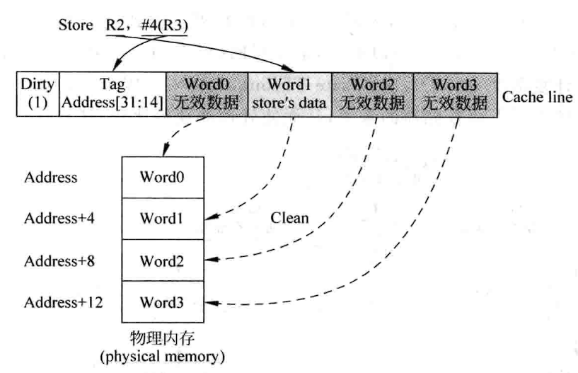

==write throuth + non-write allocate==

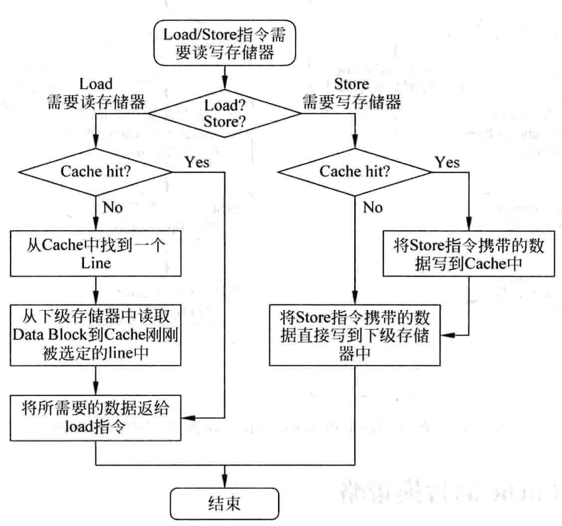

==write back + write allocate==

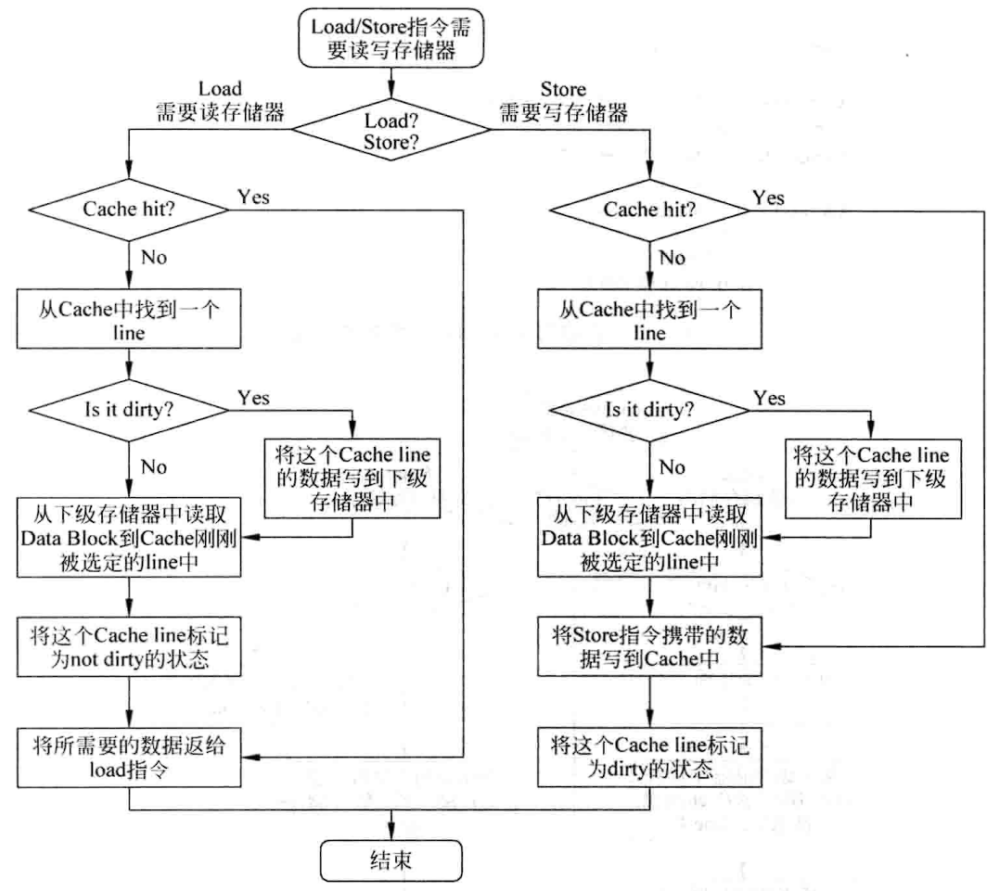

## cache替换策略

==LRU== 为每个cache line维护一个age，替换时选择age最小的，每当一个cache line被访问，age++，但成本高
==PLRU==  维护多级age位

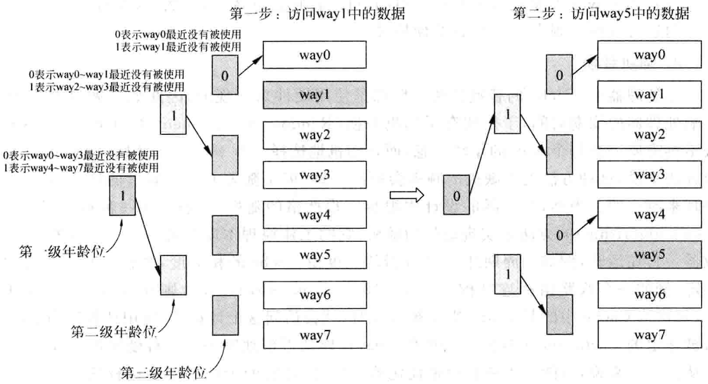

==随机替换== 维护了一个计数器

## 提高cache性能

cache buffer / pipelined cache / multilevel cache / victim cache / prefetch / non-blocking cache / critical word first / early restart

### cache buffer
解决dcache miss处理时间太久的问题
==write back==将dirty cache line放到write buffer，读取下级存储器内容，write buffer内容择机写到下级存储器
==write through== 同时将data 写入cache和write buffer
存在问题 : 系统复杂性提升，dcache miss需要查找write buffer和下级存储器，需要增加比较电路

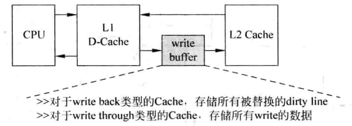

###   pipelined cache

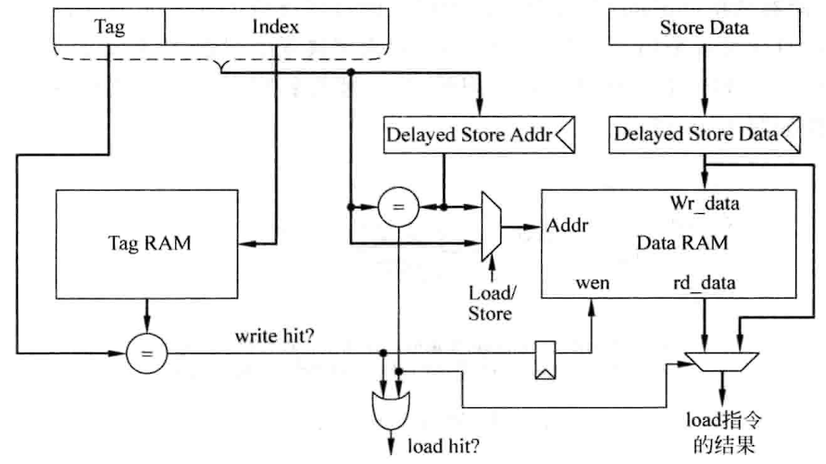

load : dcache hit,可以一周期内同时读取tag data sram
store : 先读取tag sram比较，再决定下一周期是否写入data sram
特殊情况 : load的data在store的流水线中(deyayed store data)，需要检测机制

### multilevel cache

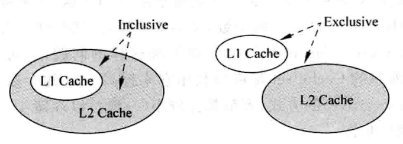

inclusive cache : 可以直接修改L1 cache,L2 cache有备份，简化了一致性（多核）
exclusive cache : 避免硬件自由浪费

### victim cache / filter cache
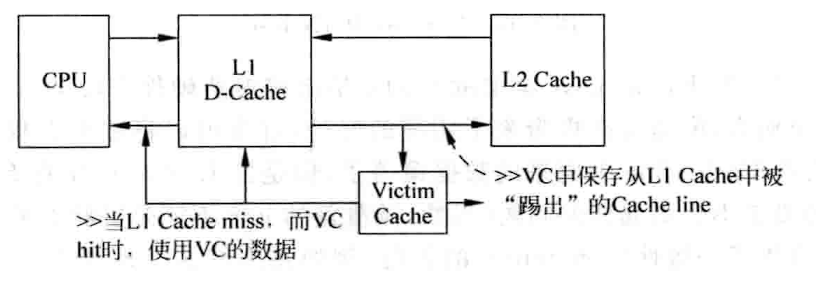

将换出的数据放入victim cache，变相增加了cache way，通常采用全相联

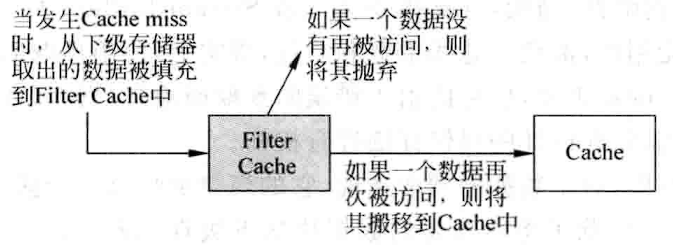

filter cache在data第一次使用时不放入cache, 再次使用时才移入，过滤偶发情况

### prefetch

==硬件预取==

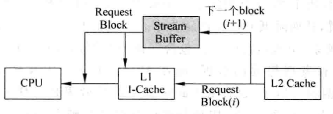

alpha-21264 ：L1 cache miss，将data block从L2 cache中取出，同时将下一个data block放入stream buffer。当L1 cache miss 但在stream buffer命中时，stream buffer中data block移到L1 cache，继续从L2 cache取data。但分支质量有很大影响。

==strided prefetch==

intel p4/IBM power5，观测规律从L2 cache取值到stream buffer

==软件预取==

编译器优化

### non-blocking cache

cache不命中时，流水线仍能够继续访问memory，但需要跟踪未命中的指令，采用了名为miss status holding registers (MSHR)的寄存器来存放Cache Miss指令的信息。除此之外还有一个input stack来存放取回但还没有写入到缓存中的数据（因此也叫做fill buffer）。cache miss有单次miss，多次miss，结构性miss(容量限制)

==implicitly addressed MSHR==

==explicitly addressed MSHR==

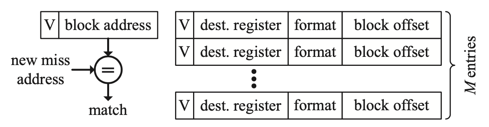

==in-cache MSHR==

cache line 等待refill时，可以用于MSHR存储，但是需要填入transient bit标志

==critical word first / early restart==

critical word first : **get the requested word first from the memory, send it asap to the processor and then continue reading the rest of the block into the cache!**

early restart : **as soon as the requested word arrives in the cache, send it to the processor and then continue reading the rest of the block into the cache**!

## 多端口cache

### true multi-port

cache 中 data path 和 control path都要复制，需要两套decoder，两个way mux，消耗资源多，功耗大，不推荐

### multiple cache copies

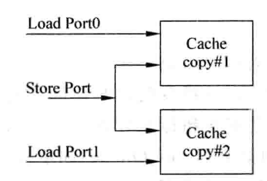

tag sram，data sram都复制，从而避免多端口设计，但是更浪费面积，两份SRAM同步困难

### multi banking

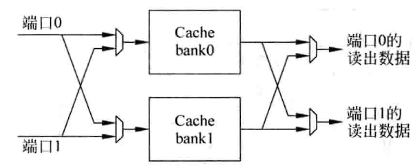

data sram是单份，其余资源是双份，bank实际上是data分块索引，但是bank也会用冲突

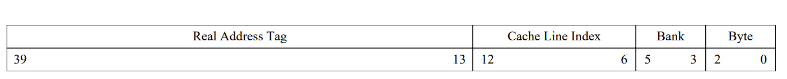

### amd opteron multi banking cache

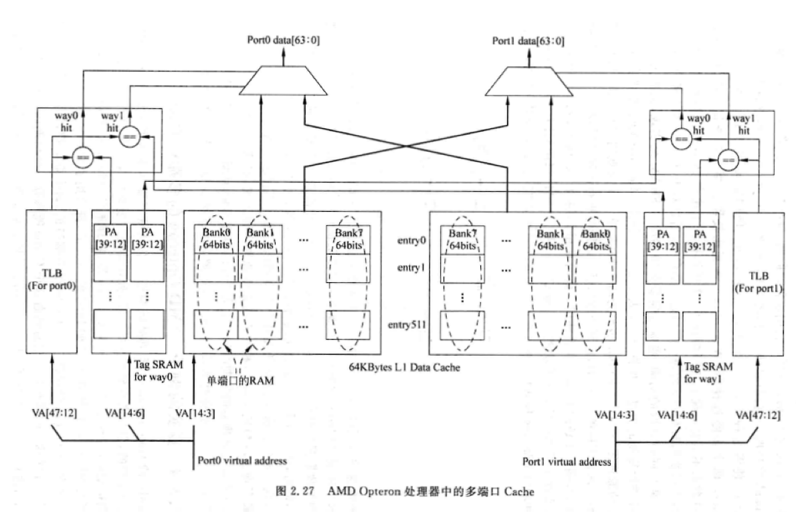

## 超标量取指令

需结合具体案例分析

refer [cache optimization](http://thebeardsage.com/cache-optimization-critical-word-first-and-early-restart/)

refer [computer architecture cache 笔记](https://zhuanlan.zhihu.com/p/400616130)

refer [现代微处理器架构 90 分钟指南](https://www.starduster.me/2020/11/05/modern-microprocessors-a-90-minute-guide/)

refer [《处理器微架构实现》笔记（一）：缓存](https://shili2017.github.io/posts/PM1)