# 虚拟存储器

## 概述

==为什么需要虚拟地址？==
应用太大，物理内存无法一次性全部装入，因此需要换入换出，使得产生更大空间的假象，该空间即为虚拟地址空间，大小和处理器位数相关。

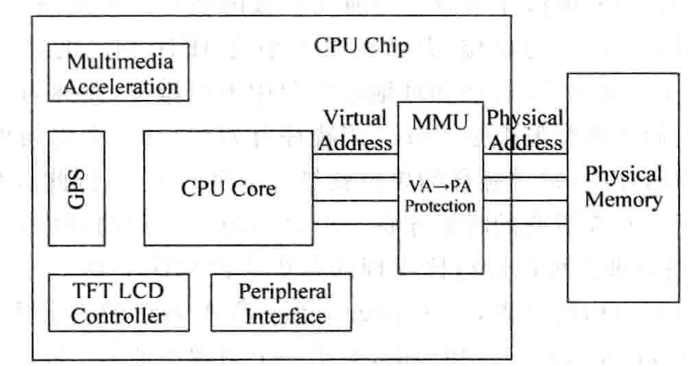

特征：
1. 应用会产生独占处理器空间的假象

2.   安全性

     

## 地址转换

基于分页
名词解释 ：VPN(virtual page number)    FPN (physical frame number)

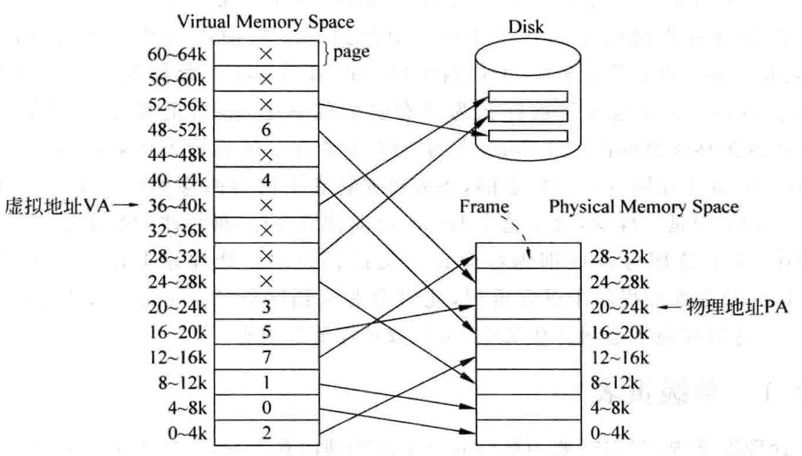

### 单级页表

==为什么不和cache一样，在页表加入tag?==  

多进程时的地址转换

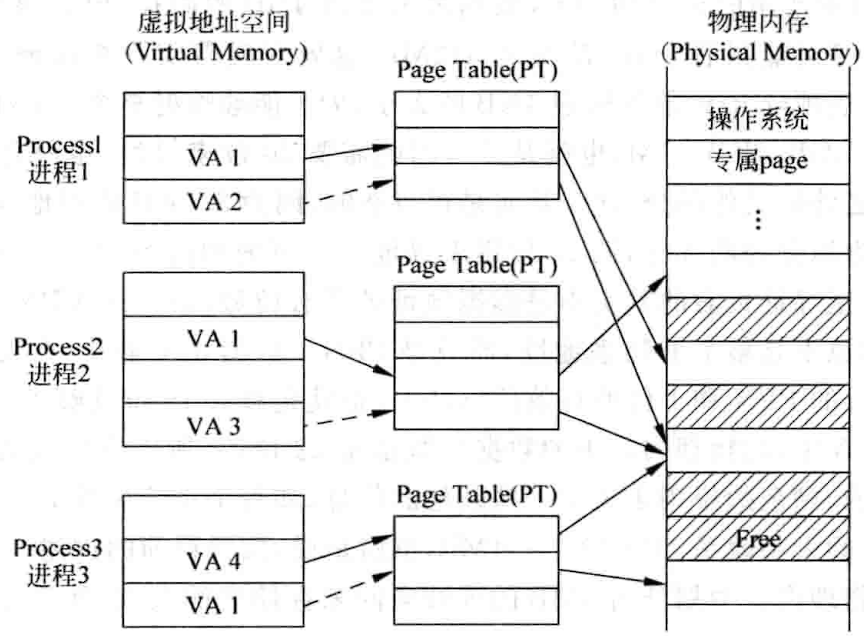

访问两次物理内存得到数据

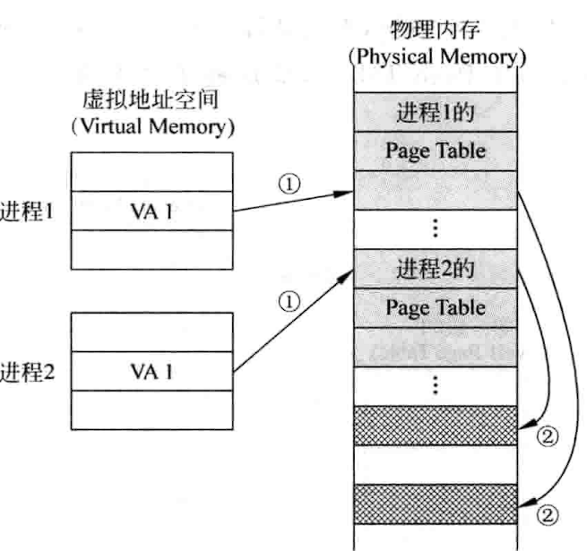

### 多级页表

==为什么需要多级页表== 

单级页表占据连续物理空间，但是多级页表中相邻子页表不连续存放在物理内存中，提高了利用率

多级页表流程

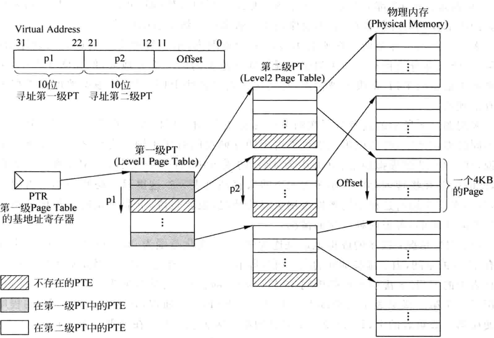

页表具有易拓展性，处理器位数增加，通过拓展页表级数完成

但是页表级数增多，访问物理内存次数也增加，下图两级页表，访问3次物理内存

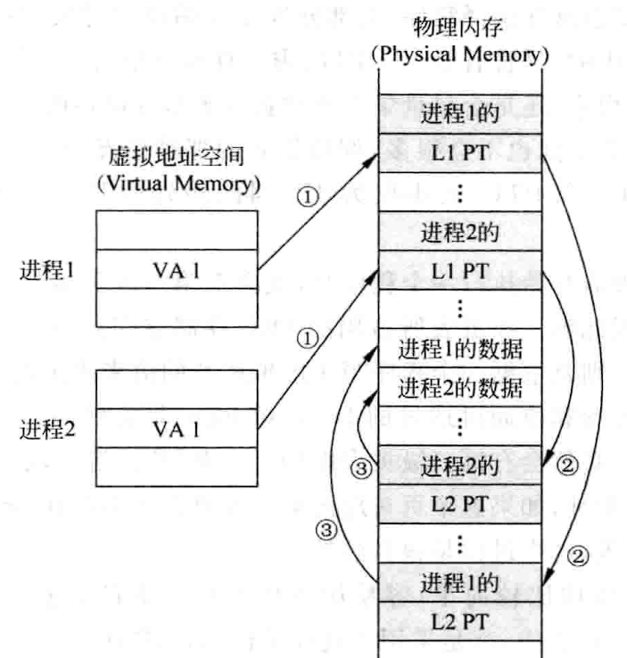

### page falut

访问页表时，发现valid为0，即没有存放映射关系，需要从下一级存储器取出对应页放到物理内存中。

==page fault 基于硬件还是软件？== 1. 访问硬盘时间太久  2. 硬件的页替换算法不够灵活

==基于软件，硬件需要提供哪些支持？==  主要是替换算法

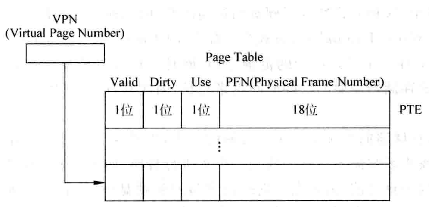

不发生page fault的访存流程

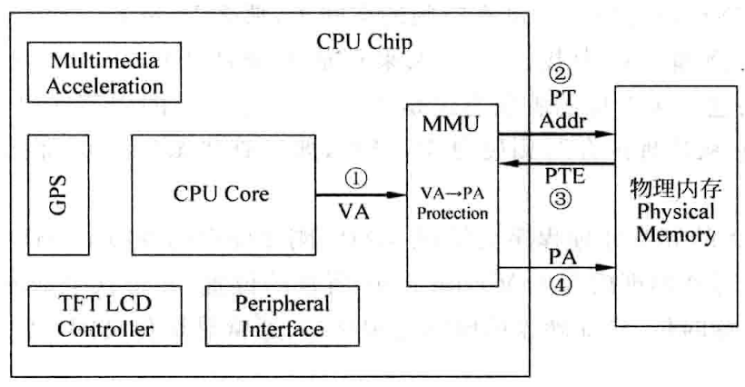

发生page fault的访存流程 （考虑dirty)

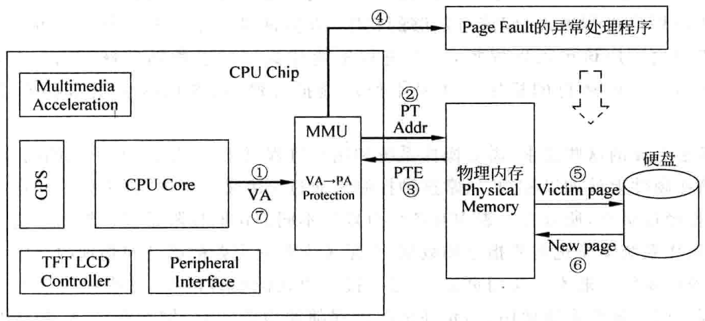

## 程序保护

==操作系统内核是否需要页表？== 

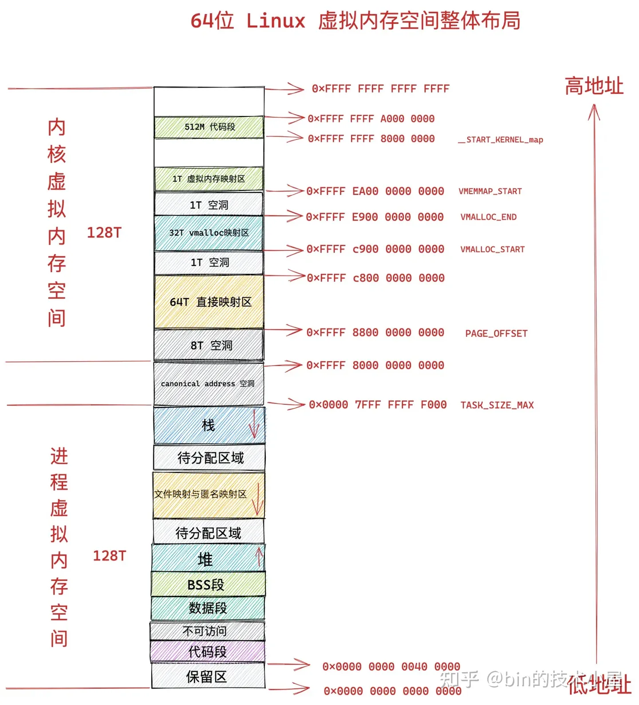

处理器有user privileged等模式，因此需要在页表中规定页的访问权限，权限有问题，则进入page fault。
常用的flag包括 valid dirty used cacheable AP(r/w)

## 加入TLB和cache

==为什么需要TLB?== 
==TLB的作用是什么?==
TLB的设计通常是两级设计，第一级是全相联，第二级是组相联，==为什么选用全相联?==
TLB有时间相关性，但没有空间相关性，因此预取算法不适用

### TLB缺失

TLB的内容

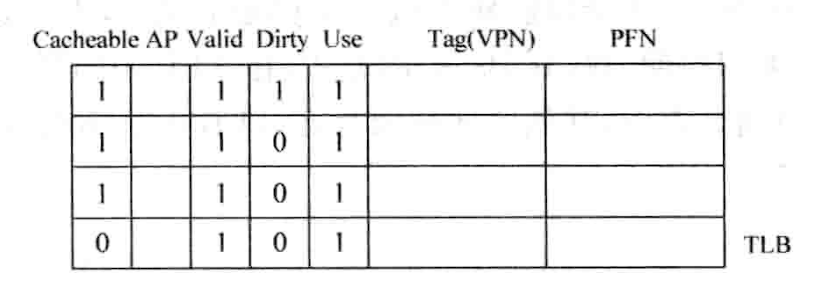

如果访问TLB发现valid为0，分两种情况：
1. 在物理内存中找到对应的pte，写入到TLB，使用pte对应的物理地址
2. 在物理内存中无法找到对应的pte，产生page fault，需要从磁盘写到物理内存，并将对应的内存起始地址写到页表中，将对应pte内容写到TLB

TLB缺失的情况分类：
1. 虚拟地址对应的页不在物理内存中

2. 虚拟地址对应的页在物理内存中，但不在TLB中

3. 虚拟地址对应的页在物理内存中，曾在TLB中，但被替换算法踢出去了

    

解决TLB缺失，主要是在页表中找到映射关系，写回到TLB中 （page table walk)
1. 软件实现，仍然需要硬件配合，但是软件实现灵活度高。TLB缺失时，同时进行两个过程 、
    1. 保存缺失的虚拟地址到特殊寄存器
    2. 产生TLB缺失异常，为防止处理异常时再次发生TLB缺失，需要将该程序放到不需要地址转换的区域，即直接使用物理地址寻址，跳过页表
        1. 软件部分：使用特殊寄存器中的地址在物理内存中找对对应pte，写回到TLB
        2. 硬件部分：需要支持读写TLB，执行TLB异常处理之前，需要清空流水线，异常处理程序退出后，从发生异常的地方重新取指令到流水线中（TLB缺失的指令到达流水线末尾再处理，对于深流水不友好）

    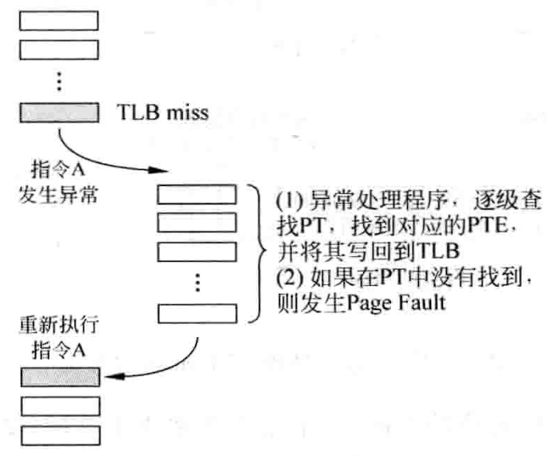

2.   硬件实现，基于MMU，使用状态机逐级查找PTE，如果valid，写回TLB；如果 not valid，产生page fault交给操作系统。

软件和硬件处理情况的对比：软件部分相比硬件部分更慢，多了一步将指令重新取到流水线中。但是从宏观层次上看，如果所需要的PTE在页表中，延迟十几个周期，不做页表中发生page fault，延迟上千周期，软硬件实现的区别就不大

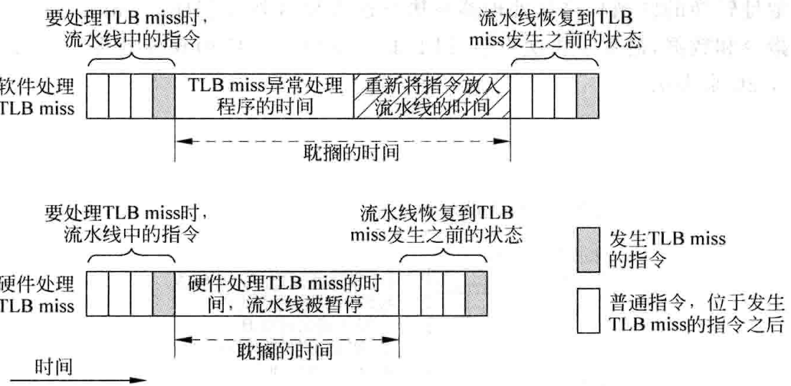

TLB替换算法：全相连 使用 随机替换（时钟算法实现近似的随机）

### TLB写入

当页从硬盘写到物理内存之后，需要考虑原来的页是否是dirty，如果是则额外处理。
同理，TLB作为页表的缓存，执行load指令会使TLB对应项used bit为1，store指令会使used 和 dirty 都变为1。
如果TLB使用write back策略，会导致页表同步较慢，如果发生page fault很难找到合适的页替换。
==解决方案== 默认TLB的所有页都需要使用，在物理内存中不能替换，需要记录页表中哪些PTE被放到了TLB。

如果加入Dcache,TLB中的内容不一定能够被Dcache全覆盖，还有另一个问题，TLB dirty page可能同步到Dcache，但是没有同步到物理内存。

### 控制TLB
主要包括3部分：
1. 将所有表项都置为空
2. 将TLB中某个ASID对应的所有表项设置为空
3. 将TLB中某个VPN对应的表项设置无效

ARM风格的TLB管理 （global:所有进程都能访问，asid:特定进程）
1. global bit not valid， asid必须相等 ；global bit valid，asid不需要进行比较
2. 将asid所有匹配的表项设置为无效的控制寄存器
3. 将TLB某些表项设置为blocked，unblocked会被清除，blocked不会
4. 读写寄存器，TLB表项可能大于32位，需使用两个寄存器

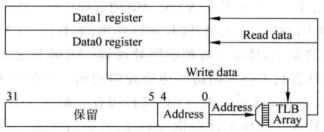

MIPS风格的TLB管理 
使用软件完成，定义了专门操作TLB的指令。

### cache的设计

#### virtual cache

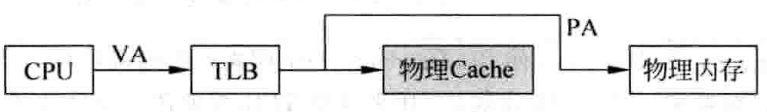

如果不使用TLB，cpu直接到cache，TLB的步骤多了流水线延迟，且增加了分支预测惩罚和load延迟

改进：
1.   上图中本质还是通过虚拟地址寻找物理地址，cache也只是物理内存的子集，可以将寻找的过程提前，在CPU和TLB之间插入虚拟cache，

     如果在虚拟cache中找到对应的物理内容，就可以省区TLB以及访存。

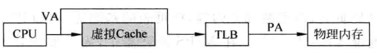

但是也会引入新的问题，物理地址的位置和内容是一一对应，而虚拟地址可能多个地址对应同一个物理内存 （浪费空间，store写入的一致性问题）
如下图，store向VA1写入数据时，1st copy PA会被修改，2nd copy PA不会，数据过时，会出错。

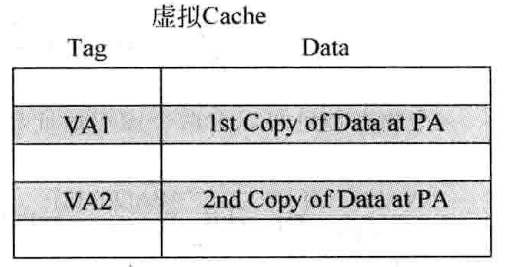

下面举例说明，下图中页内偏移相同，第12位不一致，可以通过同时更新这两处地址解决，将二者看作是一个地址，这里使用物理地址作为cache的tag，使用bank结构，但是会变相减少cache的面积，无法实际应用。

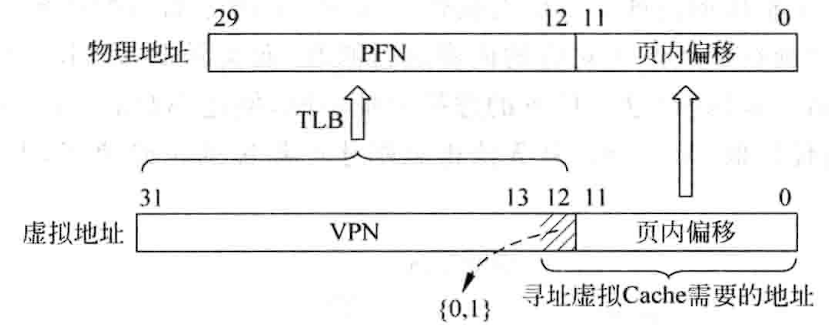

下图是bank结构，会增加硬件复杂度和功耗，同时因为进程机制，导致很多相同的虚拟地址对应不同的物理地址，因此切换进程的时候需要将cache和TLB清空。

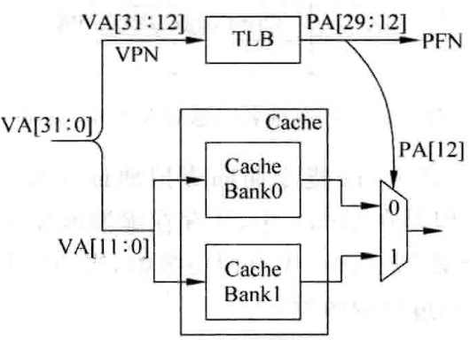

改进：为每个进程加编号ASID，这样切换进程就不用清空。但是又有新的问题，多个进程想要共享同一个页时，需要加入额外的global位，查找页表时，发现global=1，就不再理会ASID。

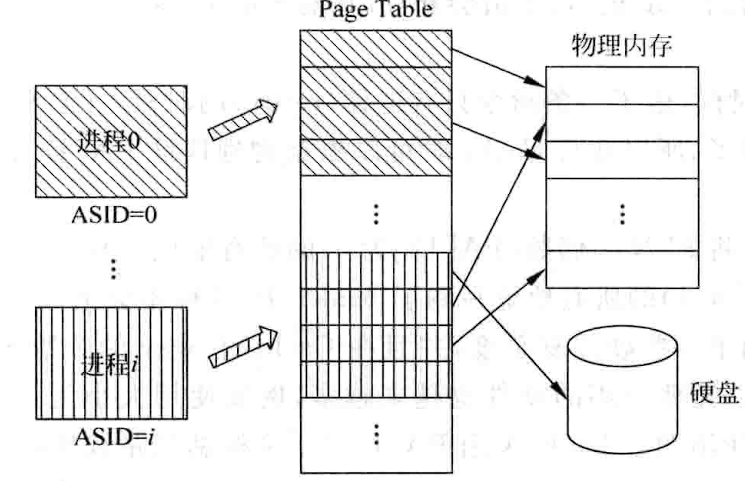

加入ASID，会使得虚拟地址位数增加，页表过大，出现较多碎片（如果采用8位ASID，page offset = 12, 一级 二级页表都是14 bit，页大小=2^14 * 4B = 64KB），因此引入3级页表，第一级采用ASID进行寻址。但是页表级数增加，会多一次访存操作，TLB处理时间更久，同时ASID也有最大值，超过限制就会替换，还需要考虑替换之后的恢复问题。

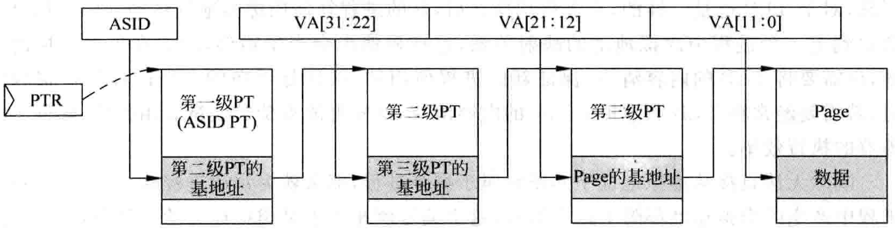

#### 控制Cache

需要处理下面的问题：

1.   DMA相关，DMA将数据从物理内存搬移到其他地方需要考虑 cache dirty，将外界数据搬移到物理内存且该数据同时缓存在cache中时，也需要考虑dirty

2.   page fault，从硬盘中读取一个页到物理内存中，如果该页为dirty，需要写回

3.   修改ICache，通过Dcache进行，二者没有直接连接，只能通过物理内存交互

     具体来说：有以下操作，其中clean是将dirty写到物理内存的过程

### 将TLB和cache放入流水线

#### PTPT (physically-indexed, physically-tagged)

由于TLB的寻址需要消耗时间，所以要流水化，但是对Icache会导致加大分支预测的惩罚，对Dcache会使load latency变大，影响wakeup。

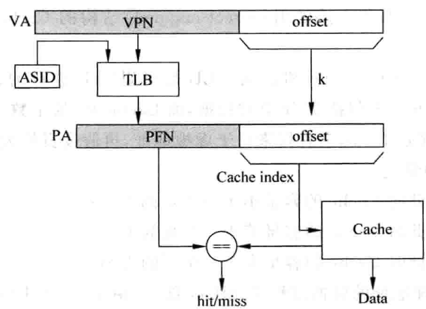

改进：offset没有变化，如果cache部分使用offset寻址就足够，就可以访问TLB的同时，访问cache

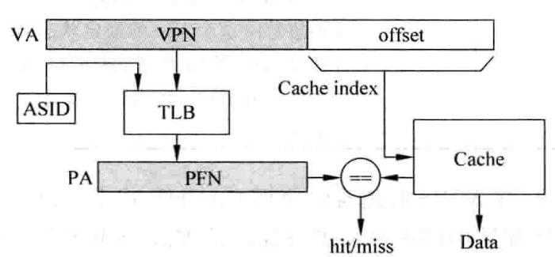

#### VIPT

采用了虚拟cache，根据cache大小，使用虚拟地址的一部分寻址cache，cache中的tag使用物理地址中的PFN。cache TLB可以做到同时访问。

分3种情况：其中 页大小=2^k 字节 ，cache line data = 2^b 字节 ，cache set = 2^L 个，

寻址cached的地址长度小于offset长度

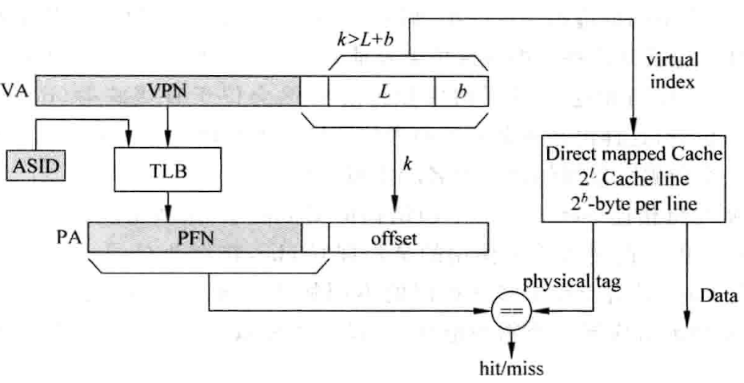

寻址cached的地址长度等于offset长度

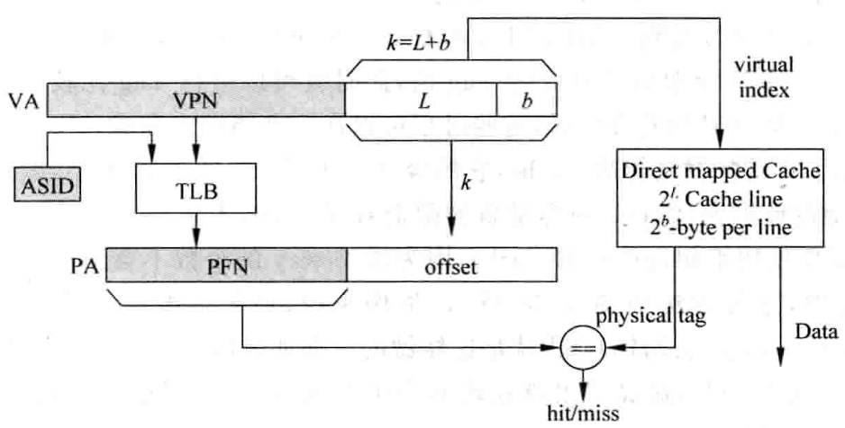

寻址cached的地址长度大于offset长度

